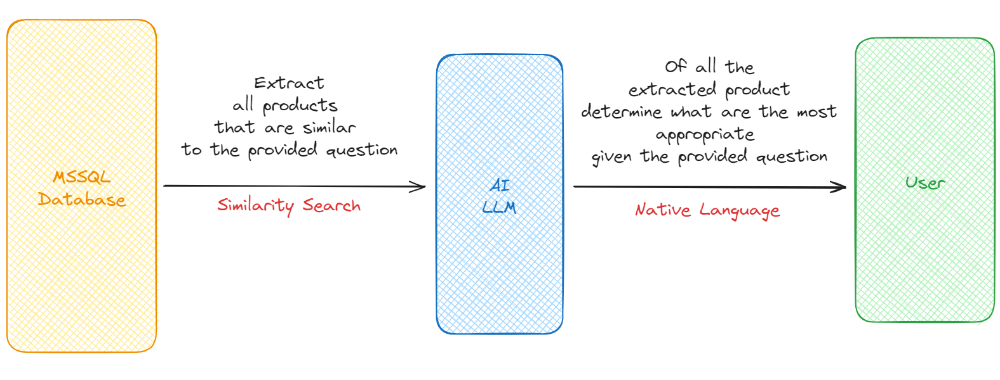
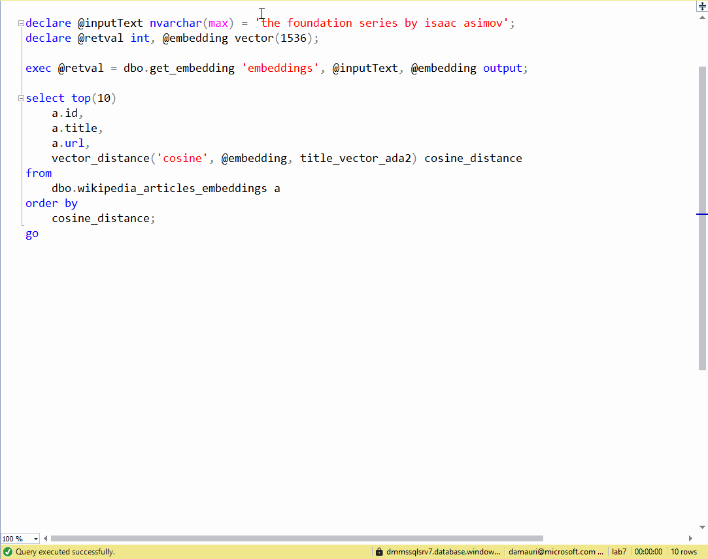

# Azure SQL DB - Retrieval Augmented Generation (RAG) with OpenAI

In this repo you will find a step-by-step guide on how to use Azure SQL Database to do Retrieval Augmented Generation (RAG) using the data you have in Azure SQL and integrating with OpenAI, directly from the Azure SQL database itself. You'll be able to ask queries in natural language and get answers from the OpenAI GPT model, using the data you have in Azure SQL Database.



# Classic or Native?

Azure SQL database can be used to easily and quickly perform vector similarity search. There are two options for this: a native option and a classic option.

The **native option** is to use the new Vector Functions, recently introduced in Azure SQL database. Vector Functions are a set of functions that can be used to perform vector operations directly in the database. 

> [!NOTE]  
> Vector Functions are in Public Preview. Learn the details about vectors in Azure SQL here: https://aka.ms/azure-sql-vector-public-preview



The **classic option** is to use the classic T-SQL to perform vector operations, with the support for columnstore indexes for getting good performances.

> [!IMPORTANT]  
> This branch (the `main` branch) uses the native vector support in Azure SQL. If you want to use the classic T-SQL, switch to the `classic` branch.

## Step-by-step guide

### Create the Azure SQL Database

Create an Azure SQL Database using the [Azure Portal](https://portal.azure.com/). You can follow the [Quickstart: Create a single database in Azure SQL Database using the Azure portal](https://docs.microsoft.com/azure/azure-sql/database/single-database-create-quickstart?tabs=azure-portal) guide to create a new Azure SQL Database.

Use a client tool like [Azure Data Studio](https://azure.microsoft.com/products/data-studio/) to connect to an Azure SQL database.

### Create Products table

Use the `./01-create-table.sql` to create the `walmart_ecommerce_product_details` table where the Walmart dataset will be imported.

### Download and import the public Walmart US Product dataset, enriched with Vector Embeddings

Download the [Walmart Dataset](https://www.kaggle.com/datasets/mauridb/product-data-from-walmart-usa-with-embeddings), unzip it and upload it (using [Azure Storage Explorer](https://learn.microsoft.com/azure/vs-azure-tools-storage-manage-with-storage-explorer?tabs=windows) for example) to an Azure Blob Storage container.

In the example the unzipped csv file `walmart-product-with-embeddings-dataset-usa.csv` is assumed to be uploaded to a blob container name `playground` and in a folder named `walmart`.

Once the file is uploaded, get the [SAS token](https://learn.microsoft.com/azure/storage/common/storage-sas-overview) to allow Azure SQL database to access it. (From Azure storage Explorer, right click on the `playground` container and than select `Get Shared Access Signature`. Set the expiration date to some time in future and then click on "Create". Copy the generated query string somewhere, for example into the Notepad, as it will be needed later)

and then use the `./02-load-table.sql` to load the csv file into the `walmart_ecommerce_product_details` table.

Make sure to replace the `<STORAGE_ACCOUNT>` and `<SAS_TOKEN>` placeholders with the value correct for your environment:

- `<STORAGE_ACCOUNT>` is the name of the storage account where the CSV file has been uploaded
- `<SAS_TOKEN>` is the Share Access Signature obtained before

Run each section (each section starts with a comment) separately. At the end of the process (will take up to a couple of minutes) you will have all the CSV data imported in the `walmart_ecommerce_product_details` table.

### Create OpenAI models.

Make sure you have an [Azure OpenAI](https://learn.microsoft.com/en-us/azure/ai-services/openai/overview) resource created in your Azure subscription. Withi the OpenAI resource create two models:

- `embeddings`, using the `text-embedding-ada-002` model
- `gpt-4o`, using the `gpt-4o` model (minimum version required: 2024-08-06 as [structured output is needed](https://learn.microsoft.com/en-us/azure/ai-services/openai/how-to/structured-outputs?tabs=python-secure%2Cdotnet-entra-id&pivots=programming-language-python#supported-models))

Then get the OpenAI URL Endpoint and API Key as they will be needed in the next step.

### Create HTTP Credentials

Create a new HTTP Credential to access the OpenAI API. Use the `./03-create-credential.sql` to create the HTTP Credential. Replace the `<OPENAI_URL>` and `<OPENAI_API_KEY>` placeholders with the correct values for your environment:

- `<OPENAI_URL>` is the OpenAI URL endpoint from the previous step
- `<OPENAI_API_KEY>` is the OpenAI API Key from the previous step

Run the script to create the HTTP Credential.

The HTTP Crential will be safely stored in the Azure SQL Database and will be used to access the OpenAI API without exposing the API Key.

### Store vectors in native binary format

To allow effienct searching of the vectors, vectors must be converted from the text format to the binary format. Use the `./04-convert-to-native-vectors.sql` to store the vectors in the binary format. Run the script to store the vectors in the binary format.

### Transform the search text into a vector using OpenAI

Now that the data is ready, you can use the OpenAI API to transform the search text into a vector. Use the `./05-get-search-vector.sql` to transform the search text into a vector. Replace the `<OPENAI_URL>` with the OpenAI URL endpoint used before and run the script to transform the search text into a vector.

### Find products related to the search text 

In order to send to GPT only the relevant products, so that it can provide better answers, you can use the vector similarity search to find the most similar products to the search text. Use the `./06-get-similar-item.sql` to find the most similar products to the search text. Run the script so that the most similar products to the search text are found.

### Use GPT to ask questions about the products

Now that the most similar products to the search text are found, you can use the GPT model to ask questions about the products. Use the `./07-chat-with-data.sql` to ask questions about the products. Azure SQL will connect to OpenAI via REST call, so replace the `<OPENAI_URL>` with the OpenAI URL endpoint used before. 

Note the how the prompt is telling the AI model how to behave and how it should expect the data to be structured. 

```
Products are provided in an assitant message using a JSON Array with the following format: [{id, name, description}].
```

The prompt also clearly specifies what results are expected from the AI model. 

The first script `07-chat-with-data.sql` will return the result as a natural language text, that is ideal if you are building a chatbot experience. The second script `08-chat-with-data-structured-output.sql` will return the result in JSON format, using the new "structured output" feature availale in the latest LLM models.

Run the script to ask questions about the products. Here's an example of a question and the answer from the AI model:

```
what are the best products for organizing a birthday party for a teenager girl?
```

and the answser (restructed from JSON format) is

```
Here are the top ten products that would be great for organizing a birthday party for a teenage girl:

1. **Princess Candle Set - Party Supplies** 
(Thoughts: This set includes cute candles in the shape of a heart, star, and tiara, perfect for adding a touch of elegance to the birthday cake.)

2. **Birthday Party Filled Favor Box (Each)** 
(Thoughts: This favor box comes filled with fun items like a glitter bounce ball and blueberry rock candy stick, making it a delightful gift for party guests.)

3. **Girls Dress Up Kids Crafts Hair Kit** 
(Thoughts: This kit allows for creative fun with hair accessories, perfect for a party activity where guests can make their own unique hairpieces.)

4. **50 Pink Plastic Plates, Cups, and Napkins Set** 
(Thoughts: This vibrant pink tableware set is perfect for serving food and drinks to guests, adding a splash of color to the party.)

...
```

Impressive! Everything happened on your own data, and right in the Azure SQL Database.


## Conclusion

This project demonstrates how to use Azure SQL Database to do Retrieval Augmented Generation (RAG) using the data you have in Azure SQL and integrating with OpenAI, directly from the Azure SQL database itself. With this approach you can easily create new applications and securely handle your data, or improve existing applications by enabling them to use the power of OpenAI's GPT.
